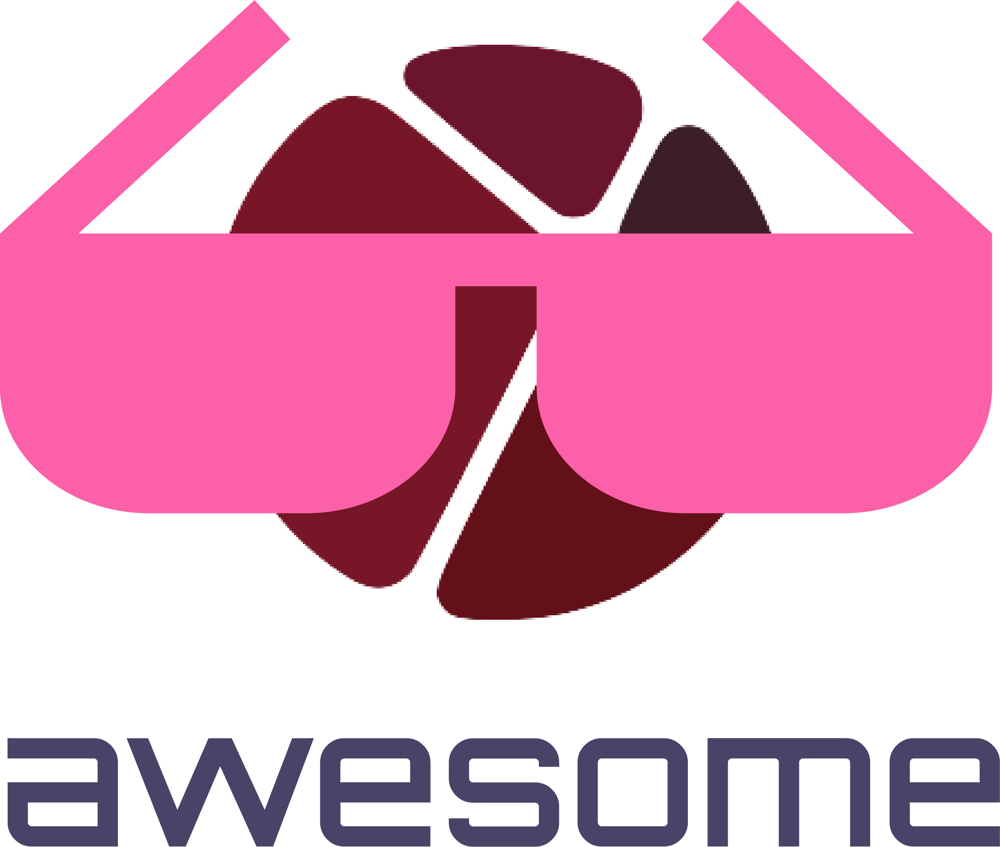

   
  
   
   

<h2 align='center'>Awesome MorteSense</h2>

A curated list of awesome things related to <a href='https://github.com/MorteSense'>MorteSense</a>
  

MorteSense is an incredible system addressed the dependency on a smartphone application by utilizing SMS text messaging within a modular motion detection security system. The system is part of an ecosystem that could be customized to meet the user's specific requirements and specifications. It was designed with sustainability in mind, capable of persisting even if manufacturer support became unavailable.

<!-- TABLE OF CONTENTS -->

  
Table of Contents

  <ol>
    <li><a href="#essentials">Essentials</a>
      <ul>
        <li><a href="#nextjs">Templates</a></li>
      </ul>
    </li>
    <li><a href="#boilerplates">Boilerplates</a>
      <ul>
        <li><a href="#list">List</a></li>
      </ul>
    </li>
    <li><a href="#boilerplates">Other</a>
      <ul>
        <li><a href="#utilities">Utilities</a></li>
        <li><a href="#research">Research</a></li>
      </ul>
    </li>
    <li><a href="#community">Community</a></li>
    <li><a href="#acknowledgements">Acknowledgements</a></li>
    <li><a href="#contributing">Contributing</a></li>
    <li><a href="#license">License</a></li>
  </ol>

## Essentials
- [MortForge](https://github.com/MorteSense/mortforge) - Backend system  
- [MortQuasar](https://github.com/MorteSense/mortquasar) - Frontend application 
- [MortCraft](https://github.com/MorteSense/mortcraft) - Hardware layer 

(<a href="#readme-top">back to top</a>)

## Boilerplates
- [Playwright](https://github.com/BuildFrom/Playwright)
- [FastAPI](https://github.com/BuildFrom/FastAPI)
- [Laravel](https://github.com/BuildFrom/Laravel)
- [MiniApp](https://github.com/BuildFrom/MiniApp)
- [NextJS](https://github.com/BuildFrom/NextJS)
- More to come

(<a href="#readme-top">back to top</a>)

## Other

- [Utilities](https://github.com/MorteSense/mortutils) - Core of MorteSense
- [Research](https://github.com/MorteSense/mortdocs) - Paper

(<a href="#readme-top">back to top</a>)

## Community

- [Discussions](https://github.com/orgs/MorteSense/discussions) on all sorts of categories

(<a href="#readme-top">back to top</a>)

## Acknowledgments

Here are some resources we made use of while developing, for those who wish to build on our work:

- [Flask Documentation](https://flask.palletsprojects.com/)
- [ReactJS Documentation](https://reactjs.org/)
- [React Router Documentation](https://reactrouter.com/)
- [Raspberry Pi Pico W Documentation](https://www.raspberrypi.org/documentation/pico/)
- [Raspberry Pi Pico W SDK](https://github.com/raspberrypi/pico-sdk/)
- [TailwindCSS Documentation](https://tailwindcss.com/docs)
- [Redis Documentation](https://redis.io/documentation)
- [Axios Documentation](https://axios-http.com/docs/intro)

(<a href="#readme-top">back to top</a>)

## Contributing

This repository is built for the community. Submit packages, articles, blogs, videos and more that utilizes MorteSense to share with the developer community for a better sustainable future. Please refer to [CONTRIBUTING.md](/CONTRIBUTING.md) for details.

(<a href="#readme-top">back to top</a>)

## License

Distributed under the Apache 2.0 License. See `LICENSE.txt` for more information.

(<a href="#readme-top">back to top</a>)

